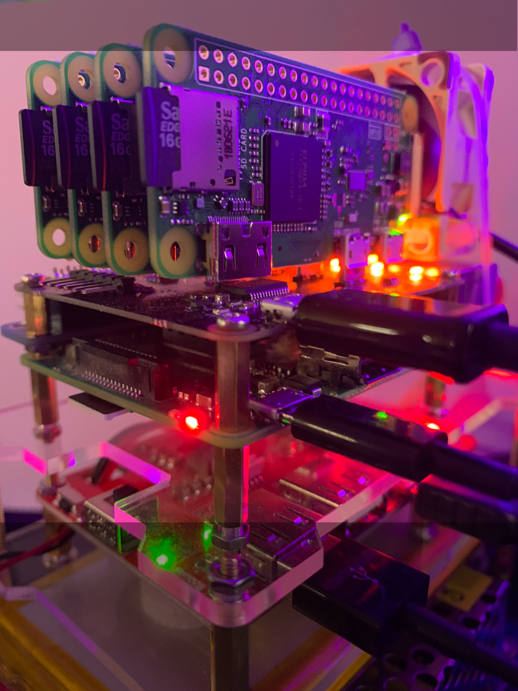

# Automatic Micro Cluster



## Equipment:
* Raspberry Pi 3B+
* 4x Raspberry Pi Zero W
* Raspberry Pi ClusterHat
* 5x MicroSD (>=16GB) Memory Cards
* Stable 5V power supply >= 3A (5V/5A PSU pictured)

Optional Equipment (Pictured)
* 40mm fan
* Raspberry Pi UPS Battery Backup w/ 3250mah & 10000mah Lipo packs
* Dual GPIO header breakout

## Project Goal:
Develop a fully autonomous environment for the deployment and management of a Raspberry Pi Clusterhat device.

## Phase One: Container Environment
Of course, we will be using containers to deploy workloads to our cluster.  Installing docker on the latest raspian-stretch-lite image was a breaze.  I simply used the get.docker.com install script and had docker installed in no time.  Unfortunatly, the RPi-Zero's were not that simple.

### Docker on Raspberry Pi Zero W - Use Hypriot.
I took a few approaches to setting up docker on the RPi Zero's:
1.  I had no success with the install script: ```curl -sSL https://get.docker.com | sh``` .  I tried a plethora of workarounds and fixes to no avail.  
2.  Next, I attempted to download ```docker-ce``` - no luck.
3.  Then ```docker.io``` which kind of worked, but was throwing errors about connecting to docker.sock that I could not rememdy.  
4.  Finally, I downladed [hypriotos-rpi-v1.10.0](https://github.com/hypriot/image-builder-rpi/releases/download/v1.10.0/hypriotos-rpi-v1.10.0.img.zip), etched to microsd and booted up on Rpi Zero W.  ```dockerd``` was already up and running with a total footprint of around 70mb in RAM. :)

### Design Specifications to note:
* Two architectures, ```arm32v7``` and ```armv6l```.
* Raspberry Pi 3B+ is the defacto ```controller``` or Master of the cluster, because it manages the power supply to the Clusterhat device.
* Best option for stable network connection was to use the individual wifi from the zero's.  Options exists to bridge ethernet connections through the usb cable to the raspberry pi 3B+.  I experienced poor network performance (dropped packets mainly) and unstable power supply using the usb netowrk tunnelling method.
* Powering the clusterhat with its own line to the power supply resulted in stable performance of all zero's while under load.
* RPIboot: I tested and had very little success netbooting the zero's from the raspberry pi 3b+ using [RPIboot](https://8086.support/content/23/88/en/guide-to-using-the-rpiboot-test-image-on-the-cluster-hat_zero-stem-or-just-a-usb-cable.html).  The zero's would choke everytime they were restarted and I would have to ungplug the usb cable and reboot.  Again, this could been because of power issues.


## Phase Two: k3OS Environment
Native cluster management using kubernetes is ideal. Work in progress.


---
# Cluster Deployment


## The ONLY REQUIREMENT is you need a wifi SSID to connect the RPi Zero W's.
To create an exclusive wifi test environment, an eth0 wlan0 bridge can be configured on the Raspberry Pi 3B+.  I won't go into that here.  To keep it simple, I am using my home wifi.


## Hardware Install: Stuff You do by hand
Time Estimate: 45 mninutes to 1 hour

1. Assemble your Raspberry Pi ClusterHat.  Check the [Clusterhat.com Official Guide](https://clusterhat.com/setup-assembly) if you have any questions.

### Provision the sd card for Raspberry Pi 3B+ (TODO: Create pre-made image)
2. Download [Lite Controller image](http://dist.8086.net/clusterhat/ClusterHAT-2019-04-08-lite-1-controller.zip) from clusterhat.com
3. Write the image to a microsd and place into the Raspberry Pi 3B+
4. Eject the fresh microsd and reinsert into your computer.
5. Copy ```ssh``` from ```./sd_card/boot-controller/ssh``` to the microsd ```boot``` partition.  Optional: also edit wpa_supplicant.conf.skel to include your wifi ssid and key.  Rename the file to ```wpa_supplicant.conf``` and also copy over to the microsd.
6. Eject the edited microsd and insert into you Raspberry Pi 3B+
7. Turn on the Raspberry Pi 3B+

### Provision the sd cards for Raspberry Pi Zero W's (TODO: Create pre-made image)
8. Download [Hypriot-rpi-v1.10.0 image](https://github.com/hypriot/image-builder-rpi/releases/download/v1.10.0/hypriotos-rpi-v1.10.0.img.zip) from hypriot.com.
9.  Write the image to 4x microsd, eject after writing, and reinsert into the computer to finish loading files.
10. Copy the ```ssh``` file from ```./sd_card/boot-zero/ssh```
11. Copy the ```cmdline.txt``` file from ```./sd_card/boot-zero/cmdline.txt```
12. You must edit the ```wpa_supplicant.conf.skel``` to include your SSID and key.  Then rename the file to ```wpa_supplicant.conf``` and copy to the sd cards.
13. Insert the sd cards into the Raspberry Pi Zero W's

### Setup up the Ansible Playbook hosts.ini file (THIS SECTION IS GETTING AUTOMATED!)

14. Find the IP address of your raspberry pi zero's
  * Login to your raspberry pi 3b+
    ```bash
    ssh pi@controller.local
    ```
  * Default password is ```clusterhat```
  * Fire up the clusterhat and give the Zero's some time to boot and expand the filesystem on the micro-sd cards.
    ```bash
    clusterhat on
    ```
  * Update the apt cache and install nmap
    ```bash
    sudo apt-get update && \
    sudo apt-get install -y nmap
    ```
  * You need to know a little about your network here.  Which range of IP's does your local network use? Two most common are 192.168.1.0/24 and 192.168.0.1/24.  The postfix ```/24``` tells the computer to check the IP range from 1-255. 
    ```bash
    sudo nmap -sn 192.168.0.1/24
    ```
    * Source: [itsfoss.com - find what devices are connected to network](https://itsfoss.com/how-to-find-what-devices-are-connected-to-network-in-ubuntu/)
  
  ```bash
  sudo pip install pysnmp
  ```


## Install Steps:
